# APort Policy Gate Example - MCP Server

Example MCP server that demonstrates APort policy enforcement for AI agent tool calls using **Simple Mode** (passport check + policy verification).

**Note**: This example uses Simple Mode, suitable for internal tools and dev environments. Secure Mode (with SCA requirements) will be added in Month 2 for enterprise/external tools.

## Features

- 🔐 Policy enforcement using APort before tool execution (Simple Mode)
- 🛠️ Two example tools: `merge_pull_request` and `process_refund`
- ✅ Real-time authorization with <100ms latency
- 📝 Immutable audit trail with decision IDs
- 🔌 Compatible with Claude Desktop, VS Code, and any MCP client

## Quick Start

### 1. Install

```bash
npm install -g @aporthq/mcp-policy-gate-example
```

### 2. Configure Claude Desktop

Add to `~/Library/Application Support/Claude/claude_desktop_config.json`:

```json
{
  "mcpServers": {
    "aport-protected-tools": {
      "command": "npx",
      "args": [
        "@aporthq/mcp-policy-gate-example"
      ],
      "env": {
        "APORT_BASE_URL": "https://api.aport.io"
      }
    }
  }
}
```

### 3. Register Agent Passport

Get an agent passport from [aport.io](https://aport.io):

```bash
curl -X POST https://api.aport.io/api/passports \
  -H "Content-Type: application/json" \
  -d '{
    "owner_id": "your_org_id",
    "capabilities": ["code.repository.merge", "finance.payment.refund"],
    "assurance_level": "L2"
  }'
```

### 4. Use in Claude

```
User: Merge PR #123 in my-org/my-repo to main branch

Claude: I'll use the merge_pull_request tool...
[Policy check happens automatically]
✅ Pull request #123 merged to main in my-org/my-repo
Decision ID: dec_1234567890
```

## Architecture (Simple Mode)

**Security Model**: Passport-based verification with policy enforcement.

```mermaid
sequenceDiagram
    participant Claude
    participant MCP Server
    participant APort
    participant Tool (GitHub API)

    Claude->>MCP Server: merge_pull_request(agent_id, repo, pr_number)
    Note over MCP Server: Extract agent_id from request
    MCP Server->>APort: POST /api/verify/policy/code.repository.merge.v1
    Note over APort: 1. Verify passport exists
    Note over APort: 2. Evaluate policy locally
    APort-->>MCP Server: { allow: true, decision_id: "dec_..." }
    MCP Server->>Tool: Execute merge (policy approved)
    Tool-->>MCP Server: Success
    MCP Server-->>Claude: ✅ PR merged (decision_id: dec_...)
```



## Policy Enforcement (Simple Mode)

Every tool call is protected by APort policies using Simple Mode:

**Endpoint**: `/api/verify/policy/{pack_id}`

**Security Flow**:
1. Extract `agent_id` from request context
2. Verify passport exists and is active
3. Evaluate policy locally (<20ms)
4. Return allow/deny decision

**Use Case**: Internal tools, dev environments, CI/CD pipelines, trusted agents

### `merge_pull_request` → `code.repository.merge.v1`
- Requires capability: `code.repository.merge` or `repo.pr.create` + `repo.merge`
- Minimum assurance level: L2
- Validates: repository access, branch protection, PR size limits

### `process_refund` → `finance.payment.refund.v1`
- Requires capability: `finance.payment.refund`
- Minimum assurance level: L2
- Validates: amount limits, currency support, daily caps, reason codes

**When to Upgrade to Secure Mode** (Month 2):
- External MCP servers (tools from outside your organization)
- Payment processors requiring cryptographic proof
- Data exports with PII/sensitive data
- Enterprise APIs with regulatory requirements

## Example: Policy Denial

```
User: Process a $100,000 refund for order 123

Claude: I'll process that refund...
[Policy check fails]
❌ Policy denied: Amount exceeds daily cap of $50,000
Decision ID: dec_0987654321
```

## Environment Variables

- `APORT_BASE_URL`: APort registry URL (default: `https://api.aport.io`)
- `APORT_TIMEOUT_MS`: Request timeout in milliseconds (default: `5000`)

## Local Development

```bash
# Clone repo
git clone https://github.com/aporthq/mcp-policy-gate-example.git
cd mcp-policy-gate-example

# Install dependencies
npm install

# Build TypeScript
npm run build

# Run locally
npm start

# Or run in dev mode with auto-reload
npm run dev
```

## MCP Client with Passport (US-1.2.2)

This example includes **client-side** examples showing how to attach agent passports to MCP tool calls. This is the agent that makes tool calls to MCP servers.

### Key Features

- ✅ **Pre-action policy verification**: Verifies policy BEFORE calling MCP tools using `verifyPolicy()`
- ✅ **Automatic passport attachment**: Agent ID is automatically added to tool call arguments
- ✅ **Policy denial handling**: Graceful retry with adjusted parameters or escalation
- ✅ **Error handling**: Comprehensive error handling with audit trails
- ✅ **Framework integration**: Examples for OpenAI, Anthropic, and custom MCP clients
- ✅ **Published SDK**: Uses `@aporthq/sdk-node` (npm) and `aporthq-sdk-python` (PyPI)

### Quick Start (TypeScript)

**Install dependencies:**
```bash
npm install @aporthq/sdk-node @modelcontextprotocol/sdk
```

**Usage:**
```typescript
import { MCPClientWithPassport } from './src/client-example';
import { StdioClientTransport } from '@modelcontextprotocol/sdk/client/stdio.js';
import { APortClient } from '@aporthq/sdk-node';

// Initialize APort client (uses published SDK)
const aportClient = new APortClient({
  baseUrl: 'https://api.aport.io',
});

const transport = new StdioClientTransport({
  command: 'npx',
  args: ['@aporthq/mcp-policy-gate-example'],
});

const client = new MCPClientWithPassport('ap_your_agent_id', transport);
await client.connect(transport);

// Call tool - policy is verified FIRST, then tool executes
const result = await client.callTool(
  'merge_pull_request',
  {
    repository: 'my-org/my-repo',
    pr_number: 123,
    base_branch: 'main',
  },
  {
    retryOnDenial: false,
    maxRetries: 3,
  }
);

console.log(result);
// Policy verification happens automatically before tool execution
```

### Quick Start (Python)

**Install dependencies:**
```bash
pip install aporthq-sdk-python
```

**Usage:**
```python
from client_example import MCPClientWithPassport
from aporthq_sdk_python import APortClient, APortClientOptions

# Initialize APort client (uses published SDK)
aport_client = APortClient(APortClientOptions(
    base_url='https://api.aport.io',
))

async with MCPClientWithPassport('ap_your_agent_id') as client:
    # Call tool - policy is verified FIRST, then tool executes
    result = await client.call_tool(
        'merge_pull_request',
        {
            'repository': 'my-org/my-repo',
            'pr_number': 123,
            'base_branch': 'main',
        },
        retry_on_denial=False,
        max_retries=3,
    )
    
    print(result)
    # Policy verification happens automatically before tool execution
```

### Policy Verification Flow

The client verifies policy BEFORE each tool call:

```typescript
// Each call verifies policy first, then executes tool
await client.callTool('merge_pull_request', {
  repository: 'my-org/my-repo',
  pr_number: 123,
});
// Flow: 1. Verify policy (code.repository.merge.v1)
//       2. If allowed, call MCP tool with agent_id
//       3. Return result with decision_id
```

### Policy Denial Handling

The client can automatically retry with adjusted parameters:

```typescript
// Automatic retry with reduced amount
await client.callTool(
  'process_refund',
  { amount: 1000000 }, // $10,000
  {
    retryOnDenial: true,  // Retry if denied
    maxRetries: 3,
  }
);
// If denied, automatically retries with amount: 500000, then 250000
```

### Integration Examples

#### OpenAI Function Calling

See [`openai-integration-example.py`](./openai-integration-example.py) for a complete example showing how to integrate MCP client with OpenAI's function calling API.

```python
from openai_integration_example import OpenAIWithMCPPassport

wrapper = OpenAIWithMCPPassport('ap_your_agent_id')

# OpenAI function calls are automatically routed to MCP tools with passport
response = await wrapper.chat_completion_with_tools(
    messages=[{"role": "user", "content": "Refund $50 to customer_123"}],
    functions=[...],
)
```

#### Anthropic Tool Use

See [`anthropic-integration-example.py`](./anthropic-integration-example.py) for a complete example showing how to integrate MCP client with Anthropic's tool use API.

```python
from anthropic_integration_example import AnthropicWithMCPPassport

wrapper = AnthropicWithMCPPassport('ap_your_agent_id')

# Anthropic tool use is automatically routed to MCP tools with passport
response = await wrapper.messages_with_tools(
    messages=[{"role": "user", "content": "Merge PR #123"}],
    tools=[...],
)
```

### Running Client Examples

#### TypeScript

```bash
# Run client examples
npm run build
node dist/client-example.js

# Or with tsx
npx tsx src/client-example.ts
```

#### Python

```bash
# Install dependencies
pip install aporthq-sdk-python mcp

# Run client examples
python client_example.py

# Run OpenAI integration example
python openai-integration-example.py

# Run Anthropic integration example
python anthropic-integration-example.py
```

### Best Practices

1. **Always attach agent_id**: The client automatically attaches `agent_id` to all tool calls
2. **Handle policy denials**: Use `retryOnDenial` for operations that can be retried with adjusted parameters
3. **Cache passports**: The client caches passports to reduce API calls
4. **Log decisions**: Always log decision IDs for audit trails
5. **Error handling**: Implement graceful degradation for network errors

### Error Handling

```typescript
try {
  const result = await client.callTool('process_refund', {...});
} catch (error) {
  if (error instanceof PolicyDeniedError) {
    // Policy denied - escalate to human or retry with lower amount
    console.error('Policy denied:', error.message);
    console.error('Decision ID:', error.result.decision_id);
  } else {
    // Network or other error
    console.error('Error:', error);
  }
}
```

## Integration with Other MCP Clients

### VS Code (Cline Extension)

Add to settings.json:

```json
{
  "cline.mcpServers": {
    "aport-protected-tools": {
      "command": "npx",
      "args": ["@aporthq/mcp-policy-gate-example"]
    }
  }
}
```

### Custom MCP Client

```typescript
import { Client } from '@modelcontextprotocol/sdk/client/index.js';
import { StdioClientTransport } from '@modelcontextprotocol/sdk/client/stdio.js';

const transport = new StdioClientTransport({
  command: 'npx',
  args: ['@aporthq/mcp-policy-gate-example'],
});

const client = new Client({
  name: 'my-client',
  version: '1.0.0',
}, {
  capabilities: {},
});

await client.connect(transport);

// Call tool (agent_id required)
const result = await client.request({
  method: 'tools/call',
  params: {
    name: 'merge_pull_request',
    arguments: {
      agent_id: 'ap_a2d10232c6534523812423eec8a1425c',
      repository: 'my-org/my-repo',
      pr_number: 123,
      base_branch: 'main',
    },
  },
});

console.log(result);
```

## File Structure

```
mcp-policy-gate-example/
├── src/
│   ├── index.ts              # MCP server (policy enforcement)
│   └── client-example.ts      # MCP client (passport attachment)
├── client_example.py          # Python MCP client
├── openai-integration-example.py    # OpenAI integration
├── anthropic-integration-example.py # Anthropic integration
├── README.md                  # This file
└── package.json
```

## License

MIT