# APort Policy Gate Example - MCP Server

Example MCP server that demonstrates APort policy enforcement for AI agent tool calls using **Simple Mode** (passport check + policy verification).

**Note**: This example uses Simple Mode, suitable for internal tools and dev environments. Secure Mode (with SCA requirements) will be added in Month 2 for enterprise/external tools.

## Features

- 🔐 Policy enforcement using APort before tool execution (Simple Mode)
- 🛠️ Two example tools: `merge_pull_request` and `process_refund`
- ✅ Real-time authorization with <100ms latency
- 📝 Immutable audit trail with decision IDs
- 🔌 Compatible with Claude Desktop, VS Code, and any MCP client

## Quick Start

### 1. Install

```bash
npm install -g @aporthq/mcp-policy-gate-example
```

### 2. Configure Claude Desktop

Add to `~/Library/Application Support/Claude/claude_desktop_config.json`:

```json
{
  "mcpServers": {
    "aport-protected-tools": {
      "command": "npx",
      "args": [
        "@aporthq/mcp-policy-gate-example"
      ],
      "env": {
        "APORT_BASE_URL": "https://api.aport.io"
      }
    }
  }
}
```

### 3. Register Agent Passport

Get an agent passport from [aport.io](https://aport.io):

```bash
curl -X POST https://api.aport.io/api/passports \
  -H "Content-Type: application/json" \
  -d '{
    "owner_id": "your_org_id",
    "capabilities": ["code.repository.merge", "finance.payment.refund"],
    "assurance_level": "L2"
  }'
```

### 4. Use in Claude

```
User: Merge PR #123 in my-org/my-repo to main branch

Claude: I'll use the merge_pull_request tool...
[Policy check happens automatically]
✅ Pull request #123 merged to main in my-org/my-repo
Decision ID: dec_1234567890
```

## Architecture (Simple Mode)

**Security Model**: Passport-based verification with policy enforcement.

```mermaid
sequenceDiagram
    participant Claude
    participant MCP Server
    participant APort
    participant Tool (GitHub API)

    Claude->>MCP Server: merge_pull_request(agent_id, repo, pr_number)
    Note over MCP Server: Extract agent_id from request
    MCP Server->>APort: POST /api/verify/policy/code.repository.merge.v1
    Note over APort: 1. Verify passport exists
    Note over APort: 2. Evaluate policy locally
    APort-->>MCP Server: { allow: true, decision_id: "dec_..." }
    MCP Server->>Tool: Execute merge (policy approved)
    Tool-->>MCP Server: Success
    MCP Server-->>Claude: ✅ PR merged (decision_id: dec_...)
```



## Policy Enforcement (Simple Mode)

Every tool call is protected by APort policies using Simple Mode:

**Endpoint**: `/api/verify/policy/{pack_id}`

**Security Flow**:
1. Extract `agent_id` from request context
2. Verify passport exists and is active
3. Evaluate policy locally (<20ms)
4. Return allow/deny decision

**Use Case**: Internal tools, dev environments, CI/CD pipelines, trusted agents

### `merge_pull_request` → `code.repository.merge.v1`
- Requires capability: `code.repository.merge` or `repo.pr.create` + `repo.merge`
- Minimum assurance level: L2
- Validates: repository access, branch protection, PR size limits

### `process_refund` → `finance.payment.refund.v1`
- Requires capability: `finance.payment.refund`
- Minimum assurance level: L2
- Validates: amount limits, currency support, daily caps, reason codes

**When to Upgrade to Secure Mode** (Month 2):
- External MCP servers (tools from outside your organization)
- Payment processors requiring cryptographic proof
- Data exports with PII/sensitive data
- Enterprise APIs with regulatory requirements

## Example: Policy Denial

```
User: Process a $100,000 refund for order 123

Claude: I'll process that refund...
[Policy check fails]
❌ Policy denied: Amount exceeds daily cap of $50,000
Decision ID: dec_0987654321
```

## Environment Variables

- `APORT_BASE_URL`: APort registry URL (default: `https://api.aport.io`)
- `APORT_TIMEOUT_MS`: Request timeout in milliseconds (default: `5000`)

## Local Development

```bash
# Clone repo
git clone https://github.com/aporthq/mcp-policy-gate-example.git
cd mcp-policy-gate-example

# Install dependencies
npm install

# Build TypeScript
npm run build

# Run locally
npm start

# Or run in dev mode with auto-reload
npm run dev
```

## Integration with Other MCP Clients

### VS Code (Cline Extension)

Add to settings.json:

```json
{
  "cline.mcpServers": {
    "aport-protected-tools": {
      "command": "npx",
      "args": ["@aporthq/mcp-policy-gate-example"]
    }
  }
}
```

### Custom MCP Client

```typescript
import { Client } from '@modelcontextprotocol/sdk/client/index.js';
import { StdioClientTransport } from '@modelcontextprotocol/sdk/client/stdio.js';

const transport = new StdioClientTransport({
  command: 'npx',
  args: ['@aporthq/mcp-policy-gate-example'],
});

const client = new Client({
  name: 'my-client',
  version: '1.0.0',
}, {
  capabilities: {},
});

await client.connect(transport);

// Call tool (agent_id required)
const result = await client.request({
  method: 'tools/call',
  params: {
    name: 'merge_pull_request',
    arguments: {
      agent_id: 'ap_a2d10232c6534523812423eec8a1425c',
      repository: 'my-org/my-repo',
      pr_number: 123,
      base_branch: 'main',
    },
  },
});

console.log(result);
```

## License

MIT